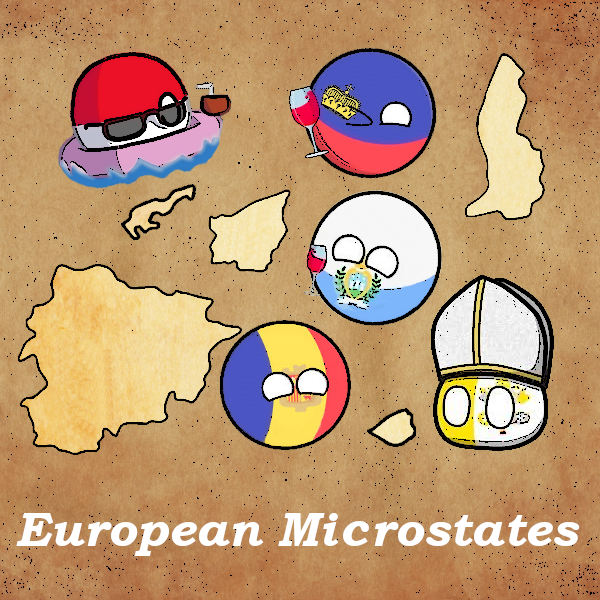

# European Microstates (HoI4 mod)

The European Microstates adds six new European countries and a special internatinal zone to the game, and allows you to play for any of them or interact with them during the game, as well as make the map more realistic.

**Countries and their tags:**  
**1. Andorra - ADO**  
**2. Liechtenstein - LIE**  
**3. Monaco - MCO**  
**4. San Marino - SMR**  
**5. Vatican City - VAT**  
**6. Free City of Danzig - DNZ**  
**7. Tangier International Zone - TIZ**  

You decide what to do: protect them, ignore them or conquer them. Unless if you are very brave you can try to take them into your own hands and turn them into a superpower.

Additionally, the **Foreign Volunteers** decision system allows microstates to call upon volunteers from other nations to reinforce their ranks and gives them a chance to build an army.

The mod also includes new graphical content (leaders, flags) and other improvements to enhance gameplay.

The mod supports the following languages:  
English  
French (special thanks to @Creepermanolo)  
Polish (special thanks to @Iskmati)  
Russian  

*Feel free to translate it into other languages as well, I will gladly add them to the mod.*

*If you want to create focus trees for microstates, I am happy to integrate them into the mod and credit you as a contributor.*

*Have a fun game!*
